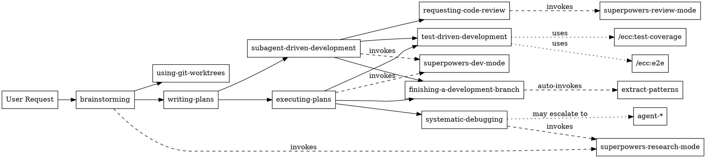

# Superpower-ECC Architecture

## Overview

Superpower-ECC is an integration project combining:
- **[Superpowers v4.1.1](https://github.com/obra/superpowers)** by Jesse Vincent - Systematic workflow discipline
- **[Everything Claude Code v1.4.1](https://github.com/affaan-m/everything-claude-code)** by Affaan Mustafa - Battle-tested production tools
- **Integration** by Faisal Alqarni - Combined into three-layer architecture

Repository: https://github.com/FaisalAlqarni/superpower-ecc

The architecture is designed around three distinct layers that work together while maintaining clear boundaries.

**Design Principles:**
- **Workflow First**: Systematic workflows guide the overall process
- **Tool Flexibility**: Quick tools available as shortcuts when appropriate
- **Specialist Support**: Agents handle focused, specialized tasks
- **Git Safety**: Read-only git operations only - all writes blocked
- **User Control**: All auto-enhancements are opt-out-able

## Three-Layer Architecture

```
┌─────────────────────────────────────────────────────────────┐
│ Layer 1: Superpowers Systematic Workflows                   │
│ (Primary: Use for structured development)                   │
├─────────────────────────────────────────────────────────────┤
│ superpowers:brainstorming                                   │
│ superpowers:writing-plans                                   │
│ superpowers:executing-plans                                 │
│ superpowers:subagent-driven-development                     │
│ superpowers:test-driven-development (enhanced)              │
│ superpowers:systematic-debugging                            │
│ superpowers:requesting-code-review                          │
│ superpowers:finishing-a-development-branch                  │
│ superpowers:using-git-worktrees                             │
└─────────────────────────────────────────────────────────────┘

┌─────────────────────────────────────────────────────────────┐
│ Layer 2: ECC Enhancements (Merged into Layer 1)            │
│ (Invoked BY workflows, not as workflow replacement)         │
├─────────────────────────────────────────────────────────────┤
│ superpowers:extract-patterns (auto-invoked by finishing)   │
│ superpowers-research-mode (invoked by brainstorming)       │
│ superpowers-review-mode (invoked by code-review)           │
│ superpowers-dev-mode (invoked by executing-plans)          │
└─────────────────────────────────────────────────────────────┘

┌─────────────────────────────────────────────────────────────┐
│ Layer 3: ECC Standalone Tools                              │
│ (Optional: Use when workflow is overkill)                   │
├─────────────────────────────────────────────────────────────┤
│ Commands: /ecc:build-fix, /ecc:refactor-clean, etc.       │
│ Agents: agent-name (context-loaded specialists)            │
└─────────────────────────────────────────────────────────────┘
```

### Layer 1: Superpowers Systematic Workflows

**Purpose**: Comprehensive, repeatable processes for software development.

**Key Characteristics**:
- Multi-step workflows with built-in quality gates
- Enforce best practices (TDD, git worktrees, code review)
- Designed for feature development and complex changes
- Use when: You want structure, repeatability, and quality assurance

**Core Workflows**:
1. **superpowers:brainstorming** → **superpowers:writing-plans** → **superpowers:executing-plans**
   - Idea to implementation pipeline
   - Creates design docs and implementation plans
   - Executes task-by-task with checkpoints

2. **superpowers:test-driven-development**
   - Red-Green-Refactor cycle enforcement
   - Enhanced with coverage tracking and E2E generation
   - Used within executing-plans and subagent-driven-development

3. **superpowers:systematic-debugging**
   - Structured problem investigation
   - Hypothesis testing with experiments
   - Used when quick fixes fail

4. **superpowers:finishing-a-development-branch**
   - Pre-merge checklist (tests, docs, cleanup)
   - Auto-invokes pattern extraction
   - Creates PR or prepares for merge

**Enhancement Integration**:
- Layer 2 mode skills (research-mode, review-mode, dev-mode) are invoked BY Layer 1 workflows
- Layer 3 commands can be used within workflows when appropriate
- Pattern extraction auto-runs at workflow completion

### Layer 2: ECC Enhancements

**Purpose**: Behavioral modifiers that enhance Layer 1 workflows without replacing them.

**Key Characteristics**:
- Not standalone workflows - invoked BY Layer 1
- Modify Claude's behavior and focus
- Provide specialized context and guidelines
- Use when: Layer 1 workflow needs specialized behavior

**Mode Skills**:

1. **superpowers-research-mode**
   - Invoked by: brainstorming, systematic-debugging
   - Behavior: Deep codebase exploration, exhaustive search
   - When: Understanding existing architecture or investigating complex issues

2. **superpowers-review-mode**
   - Invoked by: requesting-code-review
   - Behavior: Critical analysis, security focus, nitpicking
   - When: Code review checkpoint

3. **superpowers-dev-mode**
   - Invoked by: executing-plans, subagent-driven-development
   - Behavior: Implementation focus, TDD enforcement
   - When: Writing code task-by-task

**Pattern Extraction**:

**superpowers:extract-patterns** (wrapper for continuous-learning-v2)
- Auto-invoked by: finishing-a-development-branch
- Behavior: Extract learned patterns to instinct memory
- When: After completing feature or fix
- Opt-out: See docs/integration/OPT-OUT.md

**Integration Points**:
```
brainstorming skill
  └─> Invokes superpowers-research-mode for codebase exploration

executing-plans skill
  └─> Invokes superpowers-dev-mode for implementation tasks

requesting-code-review skill
  └─> Invokes superpowers-review-mode for review focus

finishing-a-development-branch skill
  └─> Auto-invokes superpowers:extract-patterns for learning
```

### Layer 3: ECC Standalone Tools

**Purpose**: Quick, focused tools for specific tasks when workflow overhead is unnecessary.

**Key Characteristics**:
- Standalone operations, not part of larger workflow
- Context-loaded specialists with deep expertise
- Fast path for experienced developers
- Use when: You know exactly what you need and workflow is overkill

**Commands** (`/ecc:*`):
- **Quick Fixes**: `/ecc:build-fix`, `/ecc:refactor-clean`
- **Testing**: `/ecc:test-coverage`, `/ecc:e2e`
- **Code Quality**: `/ecc:update-docs`, `/ecc:verify`
- **Development**: `/ecc:go-test`, `/ecc:python-review`
- **Workflows**: `/ecc:multi-plan`, `/ecc:multi-execute`

**Agents** (`agent-*`):
- **Specialists**: `build-error-resolver`, `test-failure-analyzer`
- **Domain Experts**: `security-auditor`, `performance-optimizer`
- **Language-Specific**: `python-refactorer`, `typescript-enhancer`

**Git Restrictions**:
- All commands and agents are read-only for git
- Can run: `git status`, `git diff`, `git log`
- Cannot run: `git commit`, `git push`, `git merge`, etc.
- See Git Policy section below

## Component Relationships

### How Skills Interact



### How Agents Work

**Agent Lifecycle**:
1. User or skill invokes agent (e.g., `@build-error-resolver`)
2. Agent loads with specialized context and constraints
3. Agent analyzes situation with domain expertise
4. Agent provides recommendations or performs focused task
5. Agent respects git restrictions (read-only)
6. Agent reports completion without git operations

**Agent Escalation** (build-error-resolver example):
```
User hits build error
  └─> Invokes build-error-resolver agent
      ├─> Quick pattern-match attempt (80% of cases)
      │   └─> Success: Report fix
      │   └─> Failure: Escalate to systematic-debugging
      └─> systematic-debugging workflow
          └─> Deep investigation with experiments
```

**When to Use Agents**:
- Specific, focused task with clear scope
- Need deep domain expertise
- Want fast resolution without workflow overhead
- Task fits within single conversation turn

### How Commands Work

**Command Invocation**:
```
User: /ecc:build-fix
  └─> Command loads with specific instructions
      └─> Analyzes build errors
      └─> Suggests or applies fixes
      └─> Reports completion (no git commit)
```

**Command vs Skill Decision Tree**:
```
Need to commit changes?
  ├─> Yes: Use Layer 1 workflow (executing-plans)
  └─> No: Can use /ecc:command

Need multi-step process?
  ├─> Yes: Use Layer 1 workflow
  └─> No: Can use /ecc:command

Need quality gates?
  ├─> Yes: Use Layer 1 workflow
  └─> No: Can use /ecc:command

Just need quick analysis/suggestion?
  └─> Yes: Use /ecc:command
```

## Git Restriction Enforcement

**Policy**: All AI operations are read-only for git. No commits, pushes, merges, or branch operations.

### Three-Level Enforcement

**Level 1: Hook System** (Primary defense)
- `scripts/hooks/block-git-writes.js` (PreToolUse hook)
- Blocks 17 git write operations before execution
- Provides clear error message to Claude
- Cannot be bypassed by AI

**Blocked Operations**:
```javascript
const BLOCKED_OPERATIONS = [
  'git commit',           // No commits
  'git push',             // No pushing
  'git pull',             // No pulling (can create merges)
  'git merge',            // No merging
  'git checkout',         // No branch switching
  'git switch',           // No branch switching
  'git branch -',         // No branch creation/deletion
  'git branch -D',        // No force branch deletion
  'git worktree add',     // No worktree creation
  'git worktree remove',  // No worktree removal
  'git reset',            // No history rewriting
  'git rebase',           // No rebasing
  'git stash',            // No stashing
  'git cherry-pick',      // No cherry-picking
  'git tag ',             // No tagging
  'git remote add',       // No remote management
  'git remote remove',    // No remote management
  'git remote set-url'    // No remote management
];
```

**Level 2: Agent Instructions** (Secondary defense)
- All 13 agents include explicit Git Policy section
- Instructions repeated in every agent file
- Clear directive: read-only operations only

**Example from agents/build-error-resolver.md**:
```markdown
## Git Policy

You may read git state (status, diff, log) for context only.
NEVER execute or suggest git write operations. Work in current directory/branch.
When work is complete, report completion without git operations.
```

**Level 3: Command Stripping** (Tertiary defense)
- All 26 /ecc:commands have git write operations removed
- Commands modified during integration (Task 6)
- Any git write suggestions removed from command text

### Allowed Operations

**Read-Only Git Commands**:
```bash
git status              # Check current state
git diff                # See changes
git diff --cached       # See staged changes
git log                 # View commit history
git log --oneline       # Compact history
git show <commit>       # View specific commit
git blame <file>        # See line authors
git branch              # List branches (no flags)
git remote -v           # List remotes
```

**Why These Are Safe**:
- No state modification
- No history changes
- No remote operations
- No branch operations
- Pure information gathering

### User Responsibilities

**User Must**:
- Create branches manually
- Commit changes manually
- Push to remote manually
- Merge/rebase manually
- Manage worktrees manually

**Workflow Integration**:
- Skills guide the process (what to commit, when)
- Skills suggest commit messages
- Skills indicate when work is ready
- User executes all git write operations

## Hooks Execution Flow

**Hook Types** (from `hooks/hooks.json`):

1. **PreToolUse**: Before any tool execution
2. **PostToolUse**: After any tool execution
3. **SessionStart**: At session beginning
4. **SessionEnd**: At session end
5. **PreCompact**: Before context compression
6. **Stop**: On conversation stop

### Hook Execution Order

**Session Lifecycle**:
```
Session Start
  └─> SessionStart hooks execute
      ├─> Hook 1: Session initialization
      └─> Hook 2: Load user preferences

User Message
  └─> Claude decides to use tool
      └─> PreToolUse hooks execute
          ├─> Hook 1: Git write blocker
          ├─> Hook 2: TypeScript type checking
          └─> Hook 3: Console.log warning
      └─> Tool executes (if not blocked)
      └─> PostToolUse hooks execute
          └─> Hook 1: Result validation

Context Full
  └─> PreCompact hooks execute
      ├─> Hook 1: Save important context
      └─> Hook 2: Mark checkpoint
  └─> Context compression occurs

Session End
  └─> SessionEnd hooks execute
      ├─> Hook 1: Session evaluation
      ├─> Hook 2: Save learnings
      └─> Hook 3: Cleanup temp files

User Stop
  └─> Stop hooks execute
      └─> Hook 1: Graceful shutdown
```

### Git Write Blocker (Detailed)

**File**: `scripts/hooks/block-git-writes.js`

**Execution**:
1. Claude attempts Bash tool call
2. PreToolUse hook intercepts
3. Hook scans command for blocked operations
4. If found: Return error to Claude, block execution
5. If clean: Allow tool execution

**Error Message to Claude**:
```
ERROR: Git write operation blocked by security policy.
Detected: git commit
This project enforces read-only git operations for AI.
You may use: git status, git diff, git log for context.
All commits must be performed manually by the user.
```

**Claude's Response**:
- Receives error before tool execution
- Adjusts approach (no retry of same command)
- Reports to user what needs to be done manually
- Continues with allowed operations

### Optional Hooks (Opt-Out Available)

See `docs/integration/OPT-OUT.md` for disabling:
- SessionEnd evaluation hook
- Console.log warning hook
- TypeScript type checking hook

## Naming Conventions

**Strict Naming Rules**:

### Layer 1: Superpowers Workflows
```
Format: superpowers:<workflow-name>
Examples:
  - superpowers:brainstorming
  - superpowers:test-driven-development
  - superpowers:executing-plans

Invocation: Automatic by Claude based on task
File Location: skills/<workflow-name>/SKILL.md
```

### Layer 2: Mode Skills
```
Format: superpowers-<mode-name>-mode
Examples:
  - superpowers-research-mode
  - superpowers-review-mode
  - superpowers-dev-mode

Invocation: BY Layer 1 workflows (not user-invocable)
File Location: skills/contexts/<mode-name>/SKILL.md
```

### Layer 2: Pattern Extraction
```
Format: superpowers:<tool-name>
Example:
  - superpowers:extract-patterns

Invocation: Auto-invoked by finishing-a-development-branch
File Location: skills/superpowers/<tool-name>/SKILL.md
```

### Layer 3: Commands
```
Format: /ecc:<command-name>
Examples:
  - /ecc:build-fix
  - /ecc:test-coverage
  - /ecc:refactor-clean

Invocation: User types /ecc:command-name
File Location: commands/ecc-<command-name>.md
Internal Reference: ecc-<command-name>
```

### Layer 3: Agents
```
Format: agent-<specialty>
Examples:
  - agent-build-error-resolver
  - agent-test-failure-analyzer
  - agent-security-auditor

Invocation: User types @agent-name or skill escalates
File Location: agents/<specialty>.md
Display Name: <specialty> (no agent- prefix in docs)
```

### Language Skills
```
Format: <language>-<aspect>
Examples:
  - python-patterns
  - rails-tdd
  - flutter-verification

Invocation: Auto-loaded by Claude based on file context
File Location: skills/<language>-<aspect>/SKILL.md
```

**Why These Names**:
- **superpowers:**: Signals primary workflow system
- **superpowers-*-mode**: Signals behavioral modifier
- **/ecc:**: Signals quick tool (Everything Claude Code origin)
- **agent-**: Signals specialist entity
- Clear namespace separation prevents conflicts
- Consistent with existing Superpowers conventions

## Language & Framework Skills

**Comprehensive Coverage**:
- **Python/Django**: patterns, testing, TDD, security, verification
- **Go**: patterns, testing
- **Java/Spring Boot**: patterns (JPA), TDD, security, verification
- **Ruby/Rails**: patterns (Engines focus), testing, TDD, security, verification
- **Dart/Flutter**: patterns (state management), testing, verification
- **JavaScript/TypeScript**: patterns, testing
- **Postgres/ClickHouse**: database patterns

**Auto-Loading**:
- Claude automatically loads relevant skills based on file context
- No explicit invocation needed
- Language detection from file extensions and imports
- Framework detection from project structure

**Rails Engines Emphasis**:
- 1,404 lines dedicated to Rails Engines in rails-patterns/SKILL.md
- Covers: Mountable vs Full engines, isolation, testing, migrations
- Critical for projects using Rails Engines architecture

**Flutter State Management**:
- Decision matrices for Bloc/Cubit vs Riverpod vs Provider
- When to use each pattern
- Performance and testing considerations

## Component Directory Structure

```
superpowers/
├── agents/                    # Layer 3: Specialist agents
│   ├── build-error-resolver.md
│   ├── test-failure-analyzer.md
│   └── ... (13 total)
│
├── commands/                  # Layer 3: Quick commands
│   ├── ecc-build-fix.md
│   ├── ecc-test-coverage.md
│   └── ... (26 total)
│
├── skills/                    # Layer 1 + Language skills
│   ├── brainstorming/
│   ├── test-driven-development/
│   ├── python-patterns/
│   ├── rails-patterns/       # 2,319 lines (1,404 on Engines)
│   ├── flutter-patterns/
│   └── ... (40+ skills)
│
├── skills/contexts/           # Layer 2: Mode skills
│   ├── superpowers-research-mode/
│   ├── superpowers-review-mode/
│   └── superpowers-dev-mode/
│
├── skills/superpowers/        # Layer 2: Tools
│   └── extract-patterns/      # Wraps continuous-learning-v2
│
├── scripts/hooks/             # Hook implementations
│   ├── block-git-writes.js    # Git write blocker
│   ├── session-start.js
│   └── session-end.js
│
├── hooks/
│   └── hooks.json             # Hook configuration
│
├── mcp-configs/               # MCP server configurations
│   ├── clickhouse-server.json
│   └── postgres-server.json
│
├── rules/                     # Global rules
│   ├── YAGNI-ruthlessly.md
│   └── ... (8 rules)
│
└── docs/integration/          # Integration documentation
    ├── USAGE.md               # How to use three layers
    ├── OPT-OUT.md             # How to disable features
    └── ARCHITECTURE.md        # This document
```

## Key Architectural Decisions

### 1. Why Three Layers?

**Problem**: Two competing approaches to AI-assisted development
- Superpowers: Comprehensive workflows, lots of structure
- ECC: Quick tools, minimal ceremony

**Solution**: Layer system that preserves both
- Layer 1: When you want structure (new features, learning)
- Layer 2: Enhanced Layer 1 with specialized behaviors
- Layer 3: When you're experienced and know exactly what you need

**Trade-off**: More complexity, but much more flexibility

### 2. Why Read-Only Git?

**Problem**: AI making git commits can be unpredictable
- Unexpected commit timing
- Poor commit messages
- Accidental history rewriting
- Hard to review what AI did

**Solution**: Complete git write ban
- User maintains full control over history
- AI guides but doesn't execute
- Safer for production codebases

**Trade-off**: More manual work, but much safer

### 3. Why Opt-Out Instead of Opt-In?

**Problem**: Useful features often go undiscovered
- Users don't know about E2E generation
- Pattern extraction never gets used
- Automation benefits lost

**Solution**: Auto-invoke useful features, document opt-out
- E2E suggestions appear automatically in TDD
- Pattern extraction runs after feature completion
- Clear documentation on disabling anything

**Trade-off**: Some users may find it too proactive, but docs make opt-out trivial

### 4. Why Hooks for Git Blocking?

**Problem**: AI instructions alone are unreliable
- AI might forget or misinterpret
- Different context windows, different behavior
- Security requires hard guarantees

**Solution**: PreToolUse hook enforcement
- Blocks at tool execution level
- Cannot be bypassed by AI
- Clear error messages guide AI

**Trade-off**: Requires hooks system, but necessary for security

### 5. Why Mode Skills Instead of Direct Commands?

**Problem**: Modes can conflict with workflows
- User enters research-mode, forgets to exit
- Mode persists when inappropriate
- Hard to track current mode

**Solution**: Modes invoked BY workflows, not standalone
- brainstorming invokes research-mode
- executing-plans invokes dev-mode
- Mode only active during workflow

**Trade-off**: Can't manually enter mode, but safer and clearer

## Performance Considerations

**Token Usage**:
- Layer 1 workflows: Higher token usage (comprehensive)
- Layer 2 enhancements: Moderate additional tokens
- Layer 3 tools: Lower token usage (focused)

**Initial Cost (~25% higher with this integration)**:
- More context loaded (skills, modes, agents)
- More features auto-invoked
- But: Higher quality output, fewer iterations

**Long-Term Benefit**:
- Pattern extraction reduces repeated explanations
- Better code quality = fewer debugging sessions
- Comprehensive language skills = faster development
- Worth the cost for production work

**Optimization Tips**:
- Use Layer 3 for quick tasks (lower token usage)
- Opt-out of features you don't need
- Pattern extraction pays off over time
- Use language skills consistently (AI learns patterns)

## Extension Points

**Adding New Language Support**:
1. Create `skills/<language>-patterns/SKILL.md`
2. Create `skills/<language>-testing/SKILL.md`
3. Optionally: `<language>-tdd`, `<language>-security`
4. Follow existing skill structure (rails-patterns as template)

**Adding New Agents**:
1. Create `agents/<specialty>.md`
2. Add Git Policy section (copy from existing agents)
3. Define clear scope and escalation strategy
4. Test with git write attempts (should be blocked)

**Adding New Commands**:
1. Create `commands/ecc-<name>.md`
2. Strip any git write operations
3. Use `/ecc:<name>` invocation format
4. Document in USAGE.md decision trees

**Adding New Hooks**:
1. Create hook script in `scripts/hooks/`
2. Add to `hooks/hooks.json`
3. Test execution order
4. Document opt-out in OPT-OUT.md (if optional)

## Security Model

**Threat Model**:
- AI might attempt git write operations (accidentally or deliberately)
- User might forget current branch/state
- Hooks might be bypassed if not carefully implemented

**Defenses**:
1. **Git Write Blocker** (PreToolUse hook)
   - Primary defense against git writes
   - Cannot be bypassed by AI
   - Catches all Bash tool attempts

2. **Agent Instructions** (Git Policy sections)
   - Secondary defense
   - Guides AI behavior
   - Reduces block attempts

3. **Command Stripping** (Integration Task 6)
   - Tertiary defense
   - Removes git write suggestions from commands
   - Prevents AI from seeing git write examples

4. **User Awareness** (Documentation)
   - USAGE.md explains responsibility
   - OPT-OUT.md shows control points
   - ARCHITECTURE.md (this doc) explains enforcement

**Limitations**:
- Cannot prevent user from manually executing AI suggestions
- Cannot prevent user from disabling git write blocker hook
- Requires user understanding of git responsibilities

**Best Practices**:
- Always work in git worktrees (superpowers:using-git-worktrees)
- Review AI suggestions before executing
- Test git write blocker in new sessions
- Keep hooks.json configuration under version control

## Troubleshooting

**"Git write operation blocked" Error**:
- Expected: Hook is working correctly
- Action: Manually execute suggested git operation
- Check: Are you in a worktree? (recommended)

**Mode Skill Not Activating**:
- Check: Is Layer 1 workflow invoking it?
- Mode skills are not user-invocable
- Use Layer 1 workflow that includes mode

**Agent Not Found**:
- Check: Is filename `agents/<specialty>.md`?
- Invocation: `@agent-<specialty>` or just `<specialty>`
- List all: `ls agents/`

**Command Not Found**:
- Check: Is filename `commands/ecc-<name>.md`?
- Invocation: `/ecc:<name>`
- List all: `ls commands/ecc-*.md`

**Language Skill Not Loading**:
- Auto-loading based on file context
- Check: Are you working in relevant files?
- Explicitly mention language if needed

**Hooks Not Executing**:
- Check: `hooks/hooks.json` exists and valid JSON
- Verify: Hook script exists in `scripts/hooks/`
- Test: Attempt git write operation (should be blocked)

**E2E Tests Too Aggressive**:
- See: `docs/integration/OPT-OUT.md`
- Disable: Comment lines 225-244 in test-driven-development/SKILL.md
- Opt-out available for all auto-features

## Version History

**v1.0.0** (2026-02-06) - Initial release:

**Based on:**
- Superpowers v4.1.1 by Jesse Vincent
- Everything Claude Code v1.4.1 by Affaan Mustafa

**Integrated from Superpowers v4.1.1:**
- Systematic workflows (brainstorming, planning, execution, TDD, debugging, code review)
- Git worktrees workflow
- Subagent-driven development
- Core language skills (Python/Django, Go, Java/Spring Boot)

**Integrated from Everything Claude Code v1.4.1:**
- 13 specialist agents (Layer 3)
- 26 quick commands (Layer 3)
- Hooks system (6 hook types)
- Git write blocker (security)
- Pattern extraction system

**Added by Faisal Alqarni (integration work):**
- Three-layer architecture combining both projects
- 3 mode skills (Layer 2) connecting workflows and tools
- Enhanced TDD with coverage tracking and E2E generation
- Ruby/Rails language support (4 skills, 1,404 lines on Rails Engines)
- Dart/Flutter language support (4 skills, 2,022 lines on state management)
- Comprehensive documentation (USAGE, OPT-OUT, ARCHITECTURE, RUBY-RAILS, DART-FLUTTER, MIGRATION)
- 200+ integrated files, ~25,000 lines of content

**Source Projects:**
- Superpowers v4.1.1 by Jesse Vincent: https://github.com/obra/superpowers
- Everything Claude Code v1.4.1 by Affaan Mustafa: https://github.com/affaan-m/everything-claude-code

**This Project:**
- Repository: https://github.com/FaisalAlqarni/superpower-ecc
- Created and maintained by: Faisal Alqarni

## Future Considerations

**Potential Enhancements**:
- Additional language support (Rust, Swift, Kotlin)
- More specialized agents (accessibility-auditor, i18n-validator)
- Performance profiling commands (/ecc:profile, /ecc:benchmark)
- Integration testing workflows (superpowers:integration-testing)
- Database migration patterns (rails-migrations, django-migrations)

**Known Limitations**:
- Cannot auto-commit (by design)
- Cannot work across multiple worktrees simultaneously
- Pattern extraction requires manual periodic instinct-export
- Mode skills cannot be manually invoked (by design)
- Hooks require Node.js runtime

**Research Questions**:
- Can pattern extraction reduce token usage over time?
- What's the optimal balance between auto-features and opt-out?
- Are there cases where git writes should be allowed?
- Should mode skills ever be user-invocable?

---

**Document Version**: 1.0.0
**Last Updated**: 2026-02-06
**Project**: Superpower-ECC (integration project)
**Created by**: Faisal Alqarni
**Based on**: Superpowers by Jesse Vincent, Everything Claude Code by Affaan Mustafa
**Related Docs**: USAGE.md, OPT-OUT.md, MIGRATION.md
